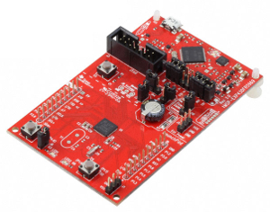

====================================
ATS programming on msp430 |travisci|
====================================

.. |travisci| image:: https://travis-ci.org/fpiot/msp430-ats.svg?branch=ats
    :target: https://travis-ci.org/fpiot/msp430-ats

Hardware: MSP-EXP430FR5969
--------------------------

* CPU: MSP430FR5969 (TI MSP430 16-bit)
* FRAM: 64 KiB
* SRAM: 2 KiB

Setup environment
-----------------

Debian GNU/Linux
~~~~~~~~~~~~~~~~

Install some Debian packages.

.. code:: bash

    $ sudo apt-get install libgmp-dev gcc-msp430 msp430-libc mspdebug:i386

Also install tools related to msp430, using `Code Composer Studio (CCS)`_.
And check location of libmsp430.so file.

.. code:: bash

    $ ./ccs_setup_linux32.bin
    $ ls ~/ti
    CCSExternalReferences/  Code Composer Studio 6.0.1.desktop*  ccsv6/  xdctools_3_30_03_47_core/
    $ file -b ~/ti/ccsv6/ccs_base/DebugServer/drivers/libmsp430.so
    ELF 32-bit LSB shared object, Intel 80386, version 1 (SYSV), dynamically linked, not stripped
    $ cd ~/ti/ccsv6/install_scripts
    $ sudo ./install_drivers.sh

Mac OS X
~~~~~~~~

T.B.D.

Windows
~~~~~~~

T.B.D.

How to build
------------

Install ATS2 http://www.ats-lang.org/.

.. code:: bash

    $ wget http://downloads.sourceforge.net/project/ats2-lang/ats2-lang/ats2-postiats-0.0.8/ATS2-Postiats-0.0.8.tgz
    $ tar xf ATS2-Postiats-0.0.8.tgz
    $ cd ATS2-Postiats-0.0.8
    $ ./configure
    $ make
    $ sudo make install
    $ export PATSHOME=/usr/local/lib/ats2-postiats-0.0.8

Compile the ATS source code for MSP430.

.. code:: bash

    $ cd msp430-ats/examples/ats/blink
    $ make
    $ file app.elf
    app.elf: ELF 32-bit LSB executable, TI msp430, version 1, statically linked, not stripped

Write to the board
------------------

Connect MSP430 board to your PC using USB cable. And run following commands.

.. code:: bash

    $ ls -l /dev/ttyACM0
    $ crw-rw-rw- 1 root dialout 166, 0 Sep 11 05:28 /dev/ttyACM0
    $ make write
    --snip--
    LD_LIBRARY_PATH=/home/kiwamu/home/kiwamu/ti/ccsv6/ccs_base/DebugServer/drivers/ mspdebug tilib "prog app.elf"
    MSPDebug version 0.22 - debugging tool for MSP430 MCUs
    Copyright (C) 2009-2013 Daniel Beer <dlbeer@gmail.com>
    --snip--
    MSP430_GetNumberOfUsbIfs
    MSP430_GetNameOfUsbIf
    Found FET: ttyACM0
    MSP430_Initialize: ttyACM0
    Firmware version is 30401000
    MSP430_VCC: 3000 mV
    MSP430_OpenDevice
    MSP430_GetFoundDevice
    Device: MSP430FR5969 (id = 0x011d)
    3 breakpoints available
    MSP430_EEM_Init
    Chip ID data: 69 81 30
    Erasing...
    Programming...
    Writing 1102 bytes at 4400 [section: .text]...
    Writing  112 bytes at 484e [section: .rodata]...
    Writing  128 bytes at ff80 [section: .vectors]...
    Done, 1342 bytes total
    MSP430_Run
    MSP430_Close

How to debug using gdb
----------------------

T.B.D.

.. _Code Composer Studio (CCS): http://www.ti.com/tool/ccstudio-msp430

Original Document
-----------------

Release: 20140602

BSP430 is a set of C language adaptation layers simplifying cross-MCU
library and application development on Texas Instruments MSP430
microcontrollers.

The target audience is experienced embedded systems developers who need full
control over the microcontroller but are willing to trade a small amount of
performance for improved component re-usability and rapid prototyping.

BSP430 features:

* A configuration infrastructure allowing you to include only those
  resources and capabilities required by your application;

* A set of abstraction layers enabling efficient identification and
  manipulation of peripheral capabilities at both register and functional
  levels;

* A callbacks callback infrastructure allowing unrelated capabilities to
  share resources including port and timer interrupt handlers;

* A platform model that enables rapid development on common hardware
  solutions including six TI experimenter boards as well as custom boards;

* Integrated support for watchdog and low power mode execution

* A build infrastructure designed to simplify creating new applications,
  currently focused on the `MSPGCC`_ toolchain in a POSIX command-line
  environment supported by GNU Make

Please see the `documentation`_, `issue tracker`_, and
`homepage`_ on github.  Get a copy using git::

 git clone git://github.com/pabigot/bsp430.git

or by downloading the master branch via: https://github.com/pabigot/bsp430/tarball/master

Copyright 2012-2014, Peter A. Bigot, and licensed under `BSD-3-Clause`_.

.. _documentation: http://pabigot.github.com/bsp430/
.. _issue tracker: http://github.com/pabigot/bsp430/issues
.. _homepage: http://github.com/pabigot/bsp430
.. _BSD-3-Clause: http://www.opensource.org/licenses/BSD-3-Clause
.. _MSPGCC: http://sourceforge.net/projects/mspgcc/
